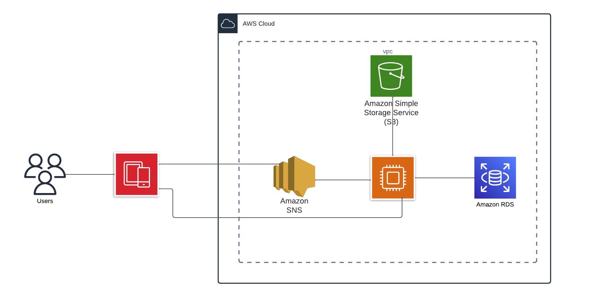

# TrainSheet Api

TrainSheet is an application that allow friends to share their progress in fitness.

# Trello Link

Click here to see the [board](https://trello.com/b/xzyeqhsC/trainsheet-board)

# Prerequisites

* Java 11 and maven install in your computer
* Docker
* git

# Start dev

## Clone repo

```
git clone https://github.com/axeljunior1/Docker-compose.git
```

## Install dependencies

````
mvn clean install
````

## Start server

```
mvn spring-boot:run
```

## Docker Compoe

```
docker compose up 
```

## CI - CD

We use `GitHub Actions` as our CI CD tools

# Architecture

